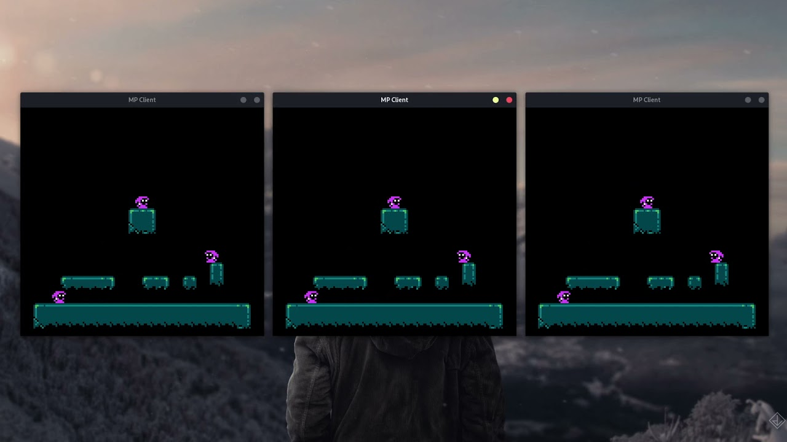

# uni-sk
## Compiling:
While in the root folder: `./build.sh`  

## Running:
While in the build folder:  
Start the server with: `./server.out`  
Start the client with: `./client.out <nickname> <address> 54321`

## Demo:

Note: Click the image to be redirected to YouTube